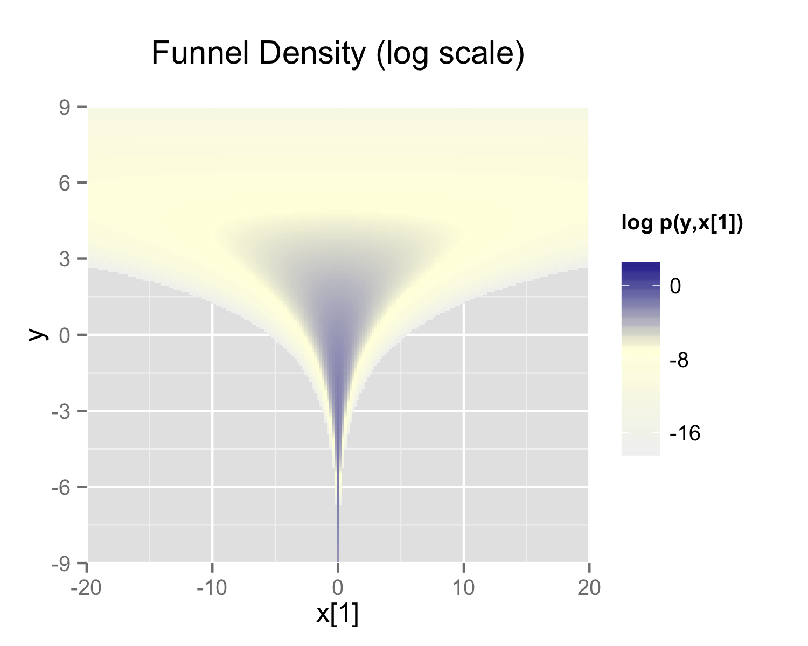

## Overview

This case study revisits the question of how to parameterize a hierarchical model
in order to improve the computational performance of an MCMC sampler.
This is discussed in the [Stan User's Guide](https://mc-stan.org/docs/stan-users-guide/) chapter "Efficiency Tuning",
section [reparameterization](https://mc-stan.org/docs/stan-users-guide/efficiency-tuning.html#funnel.figure),
and at greater length in @Betancourt-Girolami:2013 and @papa-et-al:2007.
This case study expands on that example and provides further examples of reparameterizations.

## Hierarchical models and HMC samplers

A Bayesian model with $N$ parameters defines a joint posterior probability density
over a $N$-dimensional parameter space.
Markov chain Monte Carlo algorithms generate samples from this joint posterior
and the sampler efficiency depends on the geometric properties of this joint posterior distribution.

Here we show Figure 1 from @Betancourt-Girolami:2013 which shows the structure of a simple hierarchical model
where each data item consists of both an observed value and a membership id for the group it belongs to.
Following their terminology,
there is a single population-level parameter $\phi$ and $\mathrm{N}$ local parameters ${\theta}_1, ... {\theta}_{\mathrm{N}}$,
The local parameters draw common information from the global parameter,
thus allowing for partial pooling of information across groups.
The interactions among these parameters determine the geometry of the posterior and
therefore the difficulty of sampling from it.
   
::: {.column-margin}

:::


### What is an "easy" posterior geometry?

HMC explores a posterior distribution using information about its local geometry.
Three related quantities are useful for understanding how the algorithm behaves.

**Posterior density.** The posterior density describes the relative
plausibility of points in parameter space.
Stan works with the log posterior density $\log p(\theta \mid y)$.

**Gradient.** The gradient gives the direction and rate of the steepest
increase in the log posterior density.
HMC uses this local information to simulate trajectories through parameter space.
The [Hamiltonian equation](https://mc-stan.org/docs/reference-manual/mcmc.html#the-hamiltonian)
is defined in terms of the negative log posterior density $-\log p(\theta \mid y)$.

**Hessian.** The Hessian is the matrix of second derivatives of the
negative log posterior density. It describes local curvature: how the
gradient changes as the parameters change.

The NUTS-HMC algorithm uses three 
[algorithm parameters](https://mc-stan.org/docs/reference-manual/mcmc.html#hmc-algorithm-parameters)
in order to sample from the posterior density by simulating the Hamiltonian trajectory of a particle:

* discretization time $\epsilon$ (step size)
* the Euclidean metric $M$ (mass matrix) - a single global approximation to the local curvature.

The step size and mass matrix are estimated during warmup (adaptation) and fixed during sampling.
The NUTS-HMC algorithm determines the length of the trajectory dynamically,
however it is bounded by $2^{\mathrm{max\_treedepth}} - 1$.
The HMC algorithm uses the [leapfrog integrator](https://mc-stan.org/docs/reference-manual/mcmc.html#leapfrog-integrator)
to trace an HMC trajectory using alternating discrete position and momentum updates,
(the term "leapfrog" describes this alternation).
Sampling efficiency, both in terms of iteration speed and
iterations per effective sample, is highly sensitive to these three
tuning parameters.

- If the step size is too large, the leapfrog integrator becomes inaccurate.
If the step size is too small, each trajectory requires many leapfrog steps, increasing computation time per iteration.


- If the inverse metric $M^{-1}$ is a poor estimate of the posterior covariance,
the step size $\epsilon$ must be kept small to maintain arithmetic
precision. This would lead to a large max_treedepth to compensate; again resulting in slow progress.

In all but very simple models (such as multivariate normals), the Hessian will vary as $\theta$ varies.
The more the curvature varies, the harder it is for all of the
algorithms with fixed adaptation parameters to find adaptations that
cover the entire density well.
Large differences in curvature constrain the integrator's step size,
while rapidly changing curvature makes a single global adaptation less effective.

Thus we have answered the question: what is an easy posterior geometry?
A multivariate normal.
What is a particularly easy posterior geometry?  An isotropic Gaussian.
This is a special case of the multivariate normal:

$$
\theta \sim \mathcal N(\mu,\sigma^2 I)
$$

Its variance is identical in every direction, so its equal-density contours are spheres.

Conversely, a challenging posterior density is one which
has curvature that changes rapidly across the region
of substantial posterior probability or differs greatly across directions.

The canonical example of a challenging posterior density is [Neal's funnel](https://mc-stan.org/docs/stan-users-guide/efficiency-tuning.html#funnel.figure), after @Neal:2003.
Section 8 of this article defines a distribution that exemplifies the difficulties of sampling from some hierarchical models
which has support for $y \in \mathbb{R}$ and $x \in \mathbb{R}^9$ with density
$$
p(y,x) = \textsf{normal}(y \mid 0,3) \times \prod_{n=1}^9
\textsf{normal}(x_n \mid 0,\exp(y/2)).
$$

::: {.column-margin}

:::

At left we show the plot on the log scale of $x[1], y$ .
The probability contours are shaped like ten-dimensional funnels.  The
funnel's neck is particularly sharp because of the exponential
function applied to $y$.

Following Betancourt and Girolami,  $y$ is the global parameter $\phi$, and $x$ is local parameter $\theta$.
Given these names, this distribution can be coded in Stan as follows.

```stan
parameters {
  real phi;
  vector[9] theta;
}
model {
  phi ~ normal(0, 3);
  theta ~ normal(0, exp(phi/2));
}
```


(mention Stan's [affine-transform](https://mc-stan.org/docs/reference-manual/types.html#affine-transform.section) 
The same model can be [reparameterized](SUG reparameterization discussion).

The first parameterization is known as the *centered parameterization* and the second is the *non-centered parameterization* (cite Papa et al).

These plots show the posterior geometry of the distribution; these are essentially plots of the *prior* distribution, without respect to the likelihood,
the distribution of the prior conditioned on the data.
Different data regimes produce different posterior geometries; some posterior geometries are more difficult for the sampler to explore.
The Stan User's Guide and key Stan case studies (which have been translated into other PPL frameworks),
provide small example datasets for which the non-centered parameterization is more efficient.
However this is not always the case.

To illustrate, we write the data-generating model corresponding to hierarchical structure of the Neal's funnel model and generate several datasets of increasing size.
Then we fit these datasets using both the centered and non-centered parameterizations and compare the resulting samples.


For a well-specified model, these alternative parameterizations should produce exactly the same posterior estimates for all parameters.
The difference is the amount of computation required for the MCMC sampler, either Gibbs or NUTS-HMC, to achieve satisfactory R-hat and ESS for those parameters and this difference is due to the nature of the data the model is trying to fit.

This is due the sampler algorithm.  When a hierarchical model seems to be making slow progress and the resulting diagnostics are less than satisfactory - poor ESS, many iterations at maximum tree-depth -
changing from a centered to non-centered parameterization, or vice-verse, may be in order.


## Reparameterizing a single hierarchical regression coefficient

## Reparameterizing a vector of regression coefficients

## Reparametrizing auto-regressive coefficients


### References

::: {#refs}
:::
