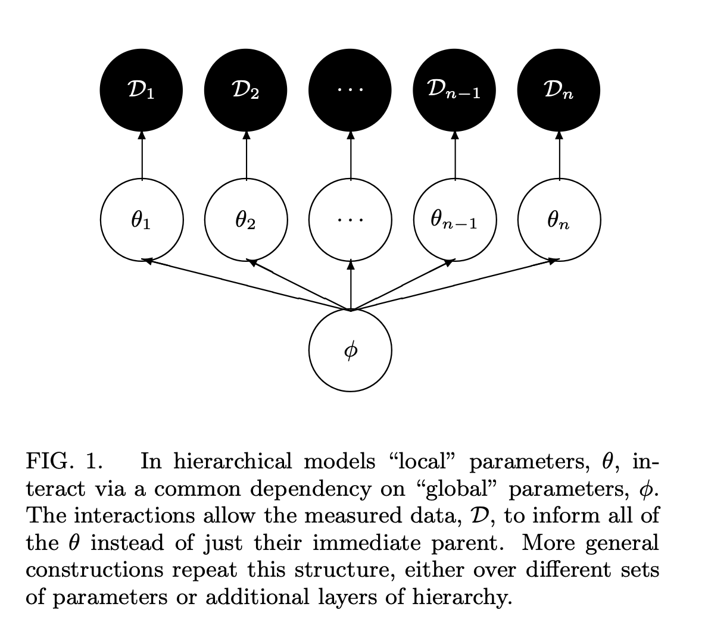
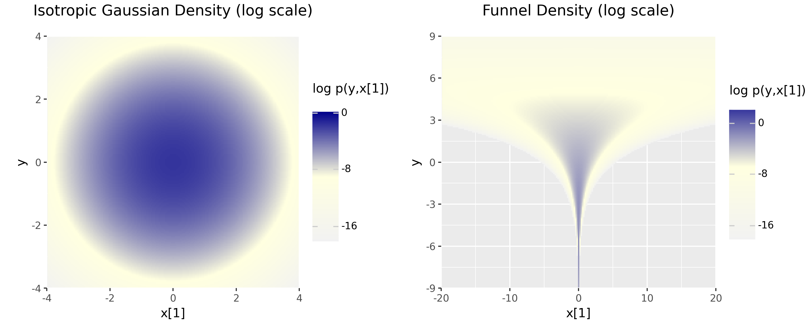

*Load libraries and set up notebook.*
```{python}
# libraries used in this notebook
#| output: false

import os
import numpy as np
import pandas as pd
import plotnine as p9
from collections.abc import Sequence
from pathlib import Path

from cmdstanpy import CmdStanModel
from python_helpers import (
    Parameterization,
    baseball_population_parameter_table,
    facet_frame,
    fit_parameterizations,
    make_baseball_posterior_geometry_plot,
    plot_baseball_player_estimates,
    plot_divergence_grid,
    plot_divergences,
    plot_parameter_estimate_variability,
    plot_rhat_reliability,
    plot_ess_efficiency,
    plot_sampler_time,
    plot_sampler_tuning,
    plot_single_fit_estimates,
)

p9.options.figure_size = (6, 6)
p9.options.dpi = 100
np.set_printoptions(precision=3)
```

## Overview

The goal of this case study is to help users who wish to build, extend, or simply use
multi-level Stan models understand what the centered and non-centered parameterizations are,
why the choice of parameterizations matters for MCMC methods, and
how to recognize situations where switching from one to the other may improve
sampling efficiency and the inference accuracy.

There are many excellent presentations on the centered and non-centered parameterization already.
It is discussed in the [Stan User's Guide](https://mc-stan.org/docs/stan-users-guide/) chapter on "Efficiency Tuning"
section on [reparameterization](https://mc-stan.org/docs/stan-users-guide/efficiency-tuning.html#funnel.figure)
and at greater length in @Betancourt-Girolami:2013, "Hamiltonian Monte Carlo for Hierarchical Models"
and @papa-et-al:2007, "A General Framework for the Parametrization of Hierarchical Models".
The Stan User's Guide and numerous case studies and examples show how to rewrite
a model from the natural, or "centered" parameterization to the non-centered version.
These sources assume a certain amount of background knowledge.
This case study connects the dots between these discussions
with the goal of helping the applied statistician or analyst
develop and trouble-shoot multi-level models for their data.


## Hierarchical models and MCMC samplers

A Bayesian model with $N$ parameters defines a probability density over a $N$-dimensional parameter space.
The diagram at the left (Figure 1 of Betancourt and Girolami)
shows the structure of a simple hierarchical model^[
There are many names for hierarchical models and their components,
see [All the names for hierarchical and multilevel modeling](https://statmodeling.stat.columbia.edu/2019/09/18/all-the-names-for-hierarchical-and-multilevel-modeling/).
]
where each data item consists of both an observed value and a membership id for the group it belongs to.
This example model has a single population-level parameter $\phi$
and $\mathrm{N}$ local parameters ${\theta}_1, ... {\theta}_{\mathrm{N}}$.
The local parameters draw common information from the global parameter
and this structure allows for partial pooling of information across groups.
   
::: {.column-margin}

:::

MCMC algorithms generate samples from the posterior distribution
and the sampler efficiency depends on the geometric properties of this distribution.
The posterior distribution is the conditional distribution of the parameters given the data.
The interaction of the parameters and the data
determine the geometry of the posterior according to Bayes's theorem:

\begin{align}
\underbrace{p(\textrm{params} \mid \textrm{data})}_{\textrm{posterior}}
&\propto
\underbrace{p(\textrm{data} \mid \textrm{params})}_{\textrm{data distribution}}
\cdot
\underbrace{p(\textrm{params})}_{\textrm{prior}}
\\[4pt]
\end{align}

::: {.column-margin}
Here we follow @Bayesian-Workflow:2026, section 5.4.
The data distribution is the *likelihood* when viewed as a function of $\theta$ given fixed data $y$
and the *sampling distribution* when viewed as a distribution over $y$ for a fixed value $\theta$.
:::

In the absence of data, the posterior distribution is the prior distribution.
The posterior density evolves from the prior according to the data distribution
and the amount and quality of the data.
If there is relatively little difference between the shape of the prior and the posterior
then reparameterizations of the priors in a model will directly affect the shape of the posterior density,
which in turn, determines the efficiency of the NUTS-HMC sampler.


### Stan's NUTS-HMC algorithm

A general understanding of the HMC algorithm is needed in order to
understand why the parameterization of hierarchical models is challenging for HMC.^[
The parameterization of hierarchical models is challenging for Gibbs samplers as well
but for different reasons which are discussed in @papa-et-al:2007.
]
The HMC algorithm works with three related quantities.

* *Posterior density*: the probability per unit volume near a point (because any given point has zero probability).
Stan works with the unnormalized log posterior density $\log p(\theta \mid y) + const$.

* *Gradient*: the vector of first derivatives of the log posterior density.
It provides the direction and rate of the steepest increase in the log density.
HMC uses this local information to simulate trajectories through parameter space.

* *Hessian*: the matrix of second derivatives of the negative log posterior density.
It describes local curvature: how the gradient changes as the parameters change.

HMC generates draws from the posterior distribution using the posterior density function and its gradient.
Gradients of the target log density function allow HMC to follow the
Hamiltonian flow in order to efficiently generate long-distance
proposals with high acceptance rates.

There are three [algorithm parameters](https://mc-stan.org/docs/reference-manual/mcmc.html#hmc-algorithm-parameters)
used to follow the Hamiltonian.

* discretization time $\epsilon$ (step size)
* the Euclidean metric $M$ (mass matrix)
* $L$ - the number of steps taken to follow the Hamiltonian trajectory to arrive at a draw from the posterior.
Every step requires computing gradient of the posterior density at that point; this is computationally expensive.

HMC simulates the (discretized) Hamiltonian trajectory of a particle which,
given a refresh of random momentum at each iteration,
traces a path through the parameter space.
The mass matrix is used to provide this momentum.
The [Stan Reference Manual MCMC chapter](https://mc-stan.org/docs/reference-manual/mcmc.html) 
provides the details.

:::{.callout-note appearance="minimal" icon=false style="border-left-color: #d3d3d3;"}
HMC introduces auxiliary momentum variables $\rho$ and draws from a
joint density

$$
p(\rho, \theta) = p(\rho  \mid  \theta) p(\theta).
$$

In most applications of HMC, including Stan, the auxiliary density is
a multivariate normal that does not depend on the parameters $\theta$,

$$
\rho \sim \mathsf{MultiNormal}(0, M),
$$

where $M$ is a positive definite mass matrix.  The mass matrix
functions as a metric and is equivalent to having a **linear preconditioner**.
It is *linear* because the same function is applied everywhere across the posterior.
It is a *preconditioner* because it rescales each dimension so that a single step size can be used for all dimensions.

Stan estimates a mass matrix during warmup using the covariance of the
warmup draws.  The mass matrix will be set to the inverse of the
covariance estimate of the warmup draws, or to the inverse of the
diagonal of the covariance estimate of the draws.
:::

The well-tuned HMC sampler requires that:

- the number of steps $L$ is sufficiently long in order to efficiently explore the posterior, but not too long so as to waste work.
- the step-size small enough to produce trajectories that obey Hamiltonian dynamics but no smaller.
- the mass matrix is a good linear pre-conditioner.

During warmup (adaptation) Stan's NUTS-HMC sampler estimates the step size and mass matrix in tandem given the model and the data.
The optimal step size is small enough to accurately follow the Hamiltonian flow
and no smaller since the smaller the step size, the more steps are needed to complete the trajectory
and the greater the computational cost.
The number of steps $L$ is determined dynamically for each iteration according to the "No-U-Turn" algorithm
introduced in @Hoffman-Gelman:2014 and refined in @Betancourt:2017.^[
Appendix A of @Betancourt:2017 describe the algorithm in the current Stan NUTS-HMC implementation.
]

If the posterior is (approximately) multivariate normal (Gaussian)
then the mass matrix is a linear map that transforms it
it into an isotropic Gaussian which is the easiest geometry for HMC.
The transformed target is a perfectly round bowl:
every direction has the same curvature, and a single step size is accurate everywhere.

When the when the posterior curvature (i.e., the Hessian) varies through the target density,
it is impossible to find a mass matrix which works as a global preconditioner.
During warmup the sampler struggles to estimate the mass matrix.
With a poor mass matrix the random momentum refresh leads to trajectories which
violate the Hamiltonian dynamic, resulting in many divergences.
To avoid divergences, the step size is adjusted downwards.
The NUTS-HMC sampler sets an upper bound on the number of steps, at $2^{\mathrm{max\_treedepth}} - 1$.
With a small step size, during sampling every trajectory makes almost no progress before hitting this upper bound.
Not only does the sampler fail to properly explore the posterior, it fails very slowly.


## Visualization: easy and difficult target densities

An easy target density for HMC is a Gaussian: its Hessian is the same at every point.
Easiest of all is the isotropic Gaussian which has identical curvature in every direction at every point.
Conversely, a challenging density is one which
has curvature that changes rapidly across the region
of substantial probability or differs greatly across directions.

The canonical example of a challenging target density is [Neal's funnel](https://mc-stan.org/docs/stan-users-guide/efficiency-tuning.html#funnel.figure), after @Neal:2003
which defines a distribution that exemplifies the difficulties of sampling from some hierarchical models.
This distribution has support for $y \in \mathbb{R}$ and $x \in \mathbb{R}^9$ with density
$$
p(y,x) = \textsf{normal}(y \mid 0,3) \times \prod_{n=1}^9
\textsf{normal}(x_n \mid 0,\exp(y/2)).
$$
The funnel distribution is hierarchical; the scale of the local parameters $x_1 \ldots x_9$ depends on the global parameter $y$.
An isotropic Gaussian on the same space would have density

$$
p(y,x) = \textsf{normal}(y \mid 0,1) \times \prod_{n=1}^9 \textsf{normal}(x_n \mid 0,1).
$$
The isotropic Gaussian is merely the product of ten normal distributions.

Both distributions are defined on the same space, $\mathbb{R}^{10}$.
Below we show the contour plots on the log scale for $x_1, y$ of the density for each.



The isotropic Gaussian contours are spherical.
The probability contours of the funnel are shaped like ten-dimensional funnels (hence the name).
The funnel's neck is particularly sharp because of the exponential function applied to $y$.

## Centered and non-centered parameterizations

The Stan model which corresponds directly to Neal's funnel in that 
local parameters `x` are defined in terms of the hierarchical parameters `y`
is called the "centered parameterization".

```{.stan include="stan/funnel_priors_cp.stan"}
```

The hierarchical dependence between `x` and `y` can be read off the model in the natural way, i.e., the way that corresponds to the mathematical formula above:  $\textsf{normal}(x_n \mid 0,\exp(y/2))$.

The non-centered parameterization of Neal's funnel shifts the correlation from the model parameters
to auxiliary variables declared in the `transformed parameters` block.

```{.stan include="stan/funnel_priors_ncp.stan"}
```

The declared parameters are now `y_std` and `x_std`, whose distribution is a fixed isotropic Gaussian
which is the ideal posterior density for the NUTS-HMC sampler.
Given a draw with values for `y_std` and `x_std` the model block then builds transformed variables `y` and `x`.
The statement `y = 3 * y_std` stretches a unit normal to scale `3`
and statement `x = exp(y/2) * x_std` stretches a unit normal to scale `exp(y/2)`.
All of the dependence between the scale of `x` and the value of `y`
has been moved into the deterministic transform.
The target distribution over $(y, x)$ is unchanged;
what changes is the coordinate system the sampler moves in.

As written, these models are priors-only models;
there are no data variables and therefore no data distribution statements.
Running these models produces a set of draws from the prior density.
To evaluate how easy or challenging the respective densities are for the NUTS-HMC sampler
we run 100 fits, using the same sequence of seeds.^[
This insures that each run starts from the identical initial point.
]
We use the CmdStan defaults:  4 chains per run, 1000 each warmup and sampling iteration.

For `y` and `x[1]` we record `ESS_bulk/s` and $\hat R$,
both the median and worst values (lowest `ESS_bulk/s` and highest $\hat R$).

::: {.column-margin}
$\hat R$ is a measure of convergence; if it is greater than $1.01$ the sampler did not
properly converge during warmup and all other estimates should be ignored.
Each fit returns 4000 draws, but we must account for autocorrelated draws.
[ESS](https://mc-stan.org/docs/reference-manual/analysis.html#effective-sample-size.section) is the *effective sample size*,
also written as $N_{eff}$.
It is the number of independent samples with the same estimation power
as the $N$ autocorrelated samples.
`ESS_bulk` is the ESS for draws in the bulk of the posterior.
`ESS_bulk/s` compares $N_{eff}$ per second; higher `ESS_bulk/s` is better
(provided that $\hat R$ is acceptable).
:::

```{python}
prior_fit_summary = pd.read_csv(os.path.join("results", "cp_ncp_prior_fits.csv"))
summary = prior_fit_summary[
    [
        "Parameterization",
        "Variable",
        "Median ESS_bulk/s",
        "Minimum ESS_bulk/s",
        "Median R_hat",
        "Maximum R_hat",
        "Runs with R_hat > 1.01",
    ]
].set_index(["Parameterization", "Variable"])

numeric_columns = summary.select_dtypes(include="number").columns

formats = {
    column: "{:,.2f}"
    if column in {"Median R_hat", "Maximum R_hat"}
    else "{:,.0f}"
    for column in numeric_columns
}
(
    summary.style
    .format(formats, na_rep="—")
    .set_properties(
        subset=numeric_columns,
        **{"text-align": "right"},
    )
)
```
For the centered parameterization,
the individual parameter estimates of `y` and `x[1]` show poor $\hat R$ values for both, indicating a failure to converge;
the sample is not a representative sample from the target density.
The non-centered parametrization runs show that all chains converge.
Note that both `y` and `y_std` have identical ESS_bulk; this is because
the non-centered transform is a deterministic rescaling of `y`.


We also record the total number of divergent transitions across all four chains,
the number of chains that had at least one divergence, and CmdStan's elapsed warmup and
sampling times.
The centered parameterization runs all have post-warmup divergences.

```{python}
# use saved output from python program:  python_helpers/run_prior_fits.py
prior_run_summary = prior_fit_summary.drop_duplicates("Parameterization")
prior_run_summary[
    [
        "Parameterization",
        "Runs with a divergence",
        "Average total divergences",
        "Average affected chains",
        "Average warmup seconds",
        "Average sampling seconds",
    ]
].set_index("Parameterization").round(2)
```

The posterior geometry is 10-dimensional.
We produce a 2-d scatterplot between the population-level parameter
and one of the local parameters.

The first pair of plots shows the space the sampler actually moves in:
`x_std[1]` and `y_std` for the non-centered parameterization (left)
and parameters `x[1]` and `y` for the centered parameterization (right).
The sampler sees the isotropic Gaussian in the non-centered version
and the funnel in the centered one, matching the analytic plots from the previous section.

```{python}
#| output: false

funnel_priors_cp_stan = os.path.join("stan", "funnel_priors_cp.stan")
funnel_priors_ncp_stan = os.path.join("stan", "funnel_priors_ncp.stan")
funnel_priors_cp = CmdStanModel(stan_file=funnel_priors_cp_stan)
funnel_priors_ncp = CmdStanModel(stan_file=funnel_priors_ncp_stan)

funnel_priors_cp_fit = funnel_priors_cp.sample(
    seed=4242,
    show_progress=False,
)
funnel_priors_ncp_fit = funnel_priors_ncp.sample(
    seed=4242,
    show_progress=False,
)

funnel_plot_cp = plot_divergences(fit=funnel_priors_cp_fit, 
                                  x_var='x[1]', 
                                  y_var='y', 
                                  title='Neal\'s funnel centered parameterization',
                                  subtitle='target distribution - parameters x[1], y')

funnel_plot_ncp_params = plot_divergences(fit=funnel_priors_ncp_fit, 
                                  x_var='x_std[1]', 
                                  y_var='y_std', 
                                  title='Neal\'s funnel non-centered parameterization',
                                  subtitle='target distribution - parameters x_std[1], y_std')

funnel_plot_ncp_xforms = plot_divergences(fit=funnel_priors_ncp_fit, 
                                  x_var='x[1]', 
                                  y_var='y', 
                                  title='Neal\'s funnel non-centered parameterization',
                                  subtitle='transformed parameters x[1], y')
```

```{python}
#| layout-ncol: 2
funnel_plot_ncp_params.show()
funnel_plot_cp.show()
```

Red dots indicate divergent transitions; points where the sampler failed
to follow a legal Hamiltonian trajectory at that iteration.
For the centered parameterization, these points are all in the neck of the funnel.
The non-centered parameterization had no divergences anywhere.
This is as expected; the isotropic Gaussian is an easy density for the HMC sampler
and the funnel is a difficult one.

Next we plot the variables that the target distribution is stated in:  `x[1]` vs `y`.

```{python}
#| layout-ncol: 2
funnel_plot_ncp_xforms.show()
funnel_plot_cp.show()
```

Both plots show the funnel density typical of a hierarchical model.
For the non-centered parameterization the y-axis ranges from $(-10, 10)$, while the
centered parameterization only ranges from $(-5, 10)$.
The non-centered parameterization is able to explore more of the funnel,
especially further into the neck, without any divergences.
As noted above, the R-hat diagnostics indicate that the centered parameterization has to converge,
so these draws are not a valid sample from the posterior.

## First hierarchical model: simple logistic regression

Given the summary statistics, diagnostics, and plots shown in the previous section,
one might conclude that the non-centered parameterization should always be used
when using MCMC methods to fit hierarchical models.
This overlooks a critical detail: those analyses were of the behavior of the model
in the absence of data, i.e., they explored the prior density $p(\theta)$.
However, the posterior is proportional to the prior times the data model:
$$
p(\theta \mid y) \propto p(\theta) \, p(y \mid \theta)
$$
The data distribution contributes its own geometry and
this determines the shape of the posterior density that the sampler must navigate.
With increasing amounts of data,
as some point the contribution of the data distribution swamps that of the prior.
For this simple model, as the sampler sees more an more trials for a given group,
it becomes easier to estimate the local parameter theta, the log-odds chance of success.

To see how this works, we add a data distribution statement and corresponding data definitions
to these Stan programs for simple hierarchical logistic regression model.
For fixed number of groups (9) and a specified number of binary trials ('N'),
we record the number of successful outcomes for each group.

```stan
data {
  int<lower=0> N;                     // count trials
  array[9] int<lower=0, upper=N> y;   // count successes
}
```

We follow the convention of using `y` for modeled data, and `x` for unmodeled data,
and `N` for dimension size variable names, adding subscripts as needed,
e.g. to generalize this from 9 groups to any number of groups,
we would define variables `N_groups`, and `N_obs`.
Instead of parameter `x` in the Neal's funnel model we use `theta`.
The example model definition of the hierarchical scale parameter is in terms
of the unconstrained real parameter `y`, which is used as the scale parameter for the prior on `x` as follows

```stan
x ~ normal(0, exp(y/2));  // implies scale is log(y^2)
```

This produces a sharply curved funnel with a long neck.
Note also that because the exponentiation creates a positive value,
this parameter can be declared without the usual `<lower=0>` constraint that
would otherwise be necessary.
Here we rename `y` to `log_sigma_sq`.
The centered parameterization data model is

```{.stan include="stan/funnel_data_cp.stan"}
```

The corresponding non-centered model follows the example in the
[Stan User's Guide](https://mc-stan.org/docs/stan-users-guide/efficiency-tuning.html#non-centered-parameterization)

```{.stan include="stan/funnel_data_ncp.stan"}
```

These alternative parameterizations should produce
exactly the same posterior estimates for all parameters;
and given sufficient compute time, the HMC sampler will (probably) do so.
But we have a limited time.
The question becomes, which parameterization is most efficient in which data regime?
To explore the problem, we generate datasets of different sizes and then fit them
using both the centered and non-centered parameterizations and compare the resulting samples.

### Simulating data

We can check that a Stan model is well-specified by writing the corresponding data-generating program
and then fitting the model on the generated data.
We use this procedure to generate a series of observations of repeated binary trials
with a given probability of success `p`, which is derived from the log-odds chance of success `theta`,
i.e., `p = inv_logit(theta)`.
Here is the Stan code:

```{.stan include="stan/datagen_repeated_binary_trials.stan"}
```

For each group we record `theta`, the group-level log-odds chance of success.
Given the sequence of repeated binary trials, we can create datasets for any number of observations.
From this raw data, we will create a series of nested datasets of the following sizes:
$2, 4, 16, 64, 128, 256, 2048, 32768$.

First we generate the raw data.

```{python}
N_GROUPS = 9
N_OBS = (2, 4, 16, 64, 128, 256, 2048, 32768)

datagen_stan = os.path.join('stan', 'datagen_repeated_binary_trials.stan')
datagen = CmdStanModel(stan_file=datagen_stan)
simulation = datagen.sample(
    data={"N_groups": N_GROUPS, "N_obs": max(N_OBS)},
    chains=1,
    iter_warmup=0,
    iter_sampling=1,
    adapt_engaged=False,
    show_progress=False,
    seed=424242
)

theta_true = simulation.stan_variable("theta")[0]
trials = simulation.stan_variable("y")[0].astype(int)
```

::: {.column-margin}
We use a fixed random seed for reproducibility; remove this to generate datasets with a different values of `theta`.
:::

Next we create the nested datasets.
```{python}
def make_nested_datasets(
    trials: np.ndarray, n_obs_values: Sequence[int]
) -> dict[int, dict[str, object]]:
    """Create Stan datasets from cumulative success counts."""
    cumulative_successes = np.cumsum(trials, axis=0)
    return {
        n_obs: {
            "N": n_obs,
            "y": cumulative_successes[n_obs - 1].tolist(),
        }
        for n_obs in n_obs_values
    }

datasets = make_nested_datasets(trials, N_OBS)

print(f'theta {theta_true}')

pd.DataFrame(
    {
        "N": N_OBS,
        "successes by group": [datasets[n_obs]["y"] for n_obs in N_OBS],
    }
)
```

### Fitting both models

To compare both models we need to fit each model to each dataset, a total of 16 fits,
and we need to do this 100 times with different random seeds
using a Python script which tabulates the diagnostics and summary statistics from each run.
The sampler provides random initial values for all parameters;
during warmup, the NUTS-HMC algorithm moves from this starting point towards
the region of the true posterior density known as the "typial set" (see @Betancourt:2017, also
this discussion from [Andrew Gelman's blog](https://statmodeling.stat.columbia.edu/2020/08/02/the-typical-set-and-its-relevance-to-bayesian-computation/))
and updates the HMC tuning parameters accordingly.
The combination of a challenging posterior geometry and a poorly chosen starting point
can result in a poor set of tuning parameters for the sampler.
By running the sampler 100 times with different random seeds we run a total of 400 chains,
each starting from a different random initialization we gain more insight into the
model's performance and robustness.

The diagnostics $\widehat R$ and bulk ESS are closely related: once the chains are sampling from the stationary distribution,
decreasing $\widehat R$ corresponds directly to increasing ESS.
We therefore begin with $\widehat R$ as a convergence screen.

```{python}
data_estimate_runs = pd.read_csv(
    os.path.join("results", "cp_ncp_data_estimate_runs.csv")
)
data_fit_summary = pd.read_csv(
    os.path.join("results", "cp_ncp_data_fits.csv")
)

plot_rhat_reliability(
    data_estimate_runs,
    maximum_r_hat_limit=1.01,
    n_obs_breaks=N_OBS,
)
```

We compare the population parameter `log_sigma_sq` and the local parameter `theta[1]`,
which are reported on the same scale by both parameterizations.
We then use ESS_bulk/s, rather than raw ESS, to compare computational efficiency,
because dividing by runtime introduces information that is not contained in $\widehat R$.
Each point in the following plot is one run.
Runs where any of the parameters have $\widehat R  > 1.01$ are shown at half opacity.
The connecting lines show the median ESS_bulk/s across all 100 runs.

```{python}
plot_ess_efficiency(
    data_estimate_runs,
    maximum_r_hat_limit=1.01,
    n_obs_breaks=N_OBS,
)
```

These plots show a clear pattern:  in the low data regime, the non-centered parameterization
can reliably converge and sample efficiently while the centered parameterization struggles;
the reverse is true in the high data regime.
For this dataset and model, the crossover occurs in the range of 100-200 observations per group.
This is a very simple model which is perfectly calibrated to the data and there is no reason to expect
that this particular size range is valid for other models and data.

Finally, we compare the computational cost directly to see  how the posterior geometry affects the amount of  computation required by the sampler.
The plot reports the median total fitting time across all 100 runs; absolute times are hardware-dependent,
so the comparison between parameterizations is more informative than the reported number of seconds.
In the large data regime, not only does the non-centered parameterization fail to fit the data reliably,
it does so very slowly.

```{python}
plot_sampler_time(
    data_fit_summary,
    n_obs_breaks=N_OBS,
)
```

To understand these patterns we repeat the plots from the previous section
which show the space the sampler moves in:
`log_sigma_sq` and `theta[1]` for the centered parameterization
and `log_sigma_sq_standard` and `theta_std[1]` for the non-centered parameterization.
To visualize all 16 fits, we divide fits by data regime:  the low data regime: $2, 4, 16, 64$
observations per group, and the high-data regime: $128, 256, 2048, 32768$ observations per group.

```{python}
#| output: false

funnel_cp_stan = os.path.join('stan', 'funnel_data_cp.stan')
funnel_cp = CmdStanModel(stan_file=funnel_cp_stan)
funnel_ncp_stan = os.path.join('stan', 'funnel_data_ncp.stan')
funnel_ncp = CmdStanModel(stan_file=funnel_ncp_stan)

PARAMETERIZATIONS = (
    Parameterization(
        label="centered",
        model=funnel_cp,
        sampled_x="theta[1]",
        sampled_y="log_sigma_sq",
    ),
    Parameterization(
        label="non-centered",
        model=funnel_ncp,
        sampled_x="theta_std[1]",
        sampled_y="log_sigma_sq_std",
    ),
)

fits = fit_parameterizations(
    parameterizations=PARAMETERIZATIONS,
    datasets=datasets,
    n_obs_values=N_OBS,
    seed_offset=12345,
)
```

The low data regime plots are all plotted on the same scale:
the x-axis ranges from $(-4, 8)$ and the y-axis ranges from $(-12, 6)$.
In the low data regime, the centered parameterization plots are still all funnel shaped;
the non-centered parameterization plots are not spherical; of these, the very low data regime plot
is most symmetric-looking and the non-centered parameterization explores more of the posterior than
its centered counterpart.

```{python}
LOW_DATA_N = N_OBS[:4]

low_data_plot = plot_divergence_grid(
    facet_frame(fits, LOW_DATA_N),
    parameterizations=PARAMETERIZATIONS,
    title="Low data regime: group[1] parameter against population scale",
    coords = p9.coord_cartesian(xlim=(-4, 8), ylim=(-12, 6))
)
low_data_plot
```

With more data, the sampler is able to get a tighter estimate on estimates of both `theta` and `log_sigma_sq`.
The high data regime plots are plotted with x-axis range $(-3, 3)$ and the y-axis range from $(-4, 2)$,
(cf x-axis $(-4, 8)$, and y-axis $(-12, 6)$).


```{python}
HIGH_DATA_N = N_OBS[4:]
high_data_plot = plot_divergence_grid(
    facet_frame(fits, HIGH_DATA_N),
    parameterizations=PARAMETERIZATIONS,
    title="High data regime: sampler parameter against population scale",
    coords = p9.coord_cartesian(xlim=(-3, 3), ylim=(-4, 2))
)
high_data_plot
```

### Sampler behaviors in low and high data regimes

The centered model has a hierarchical prior on the population variance and group-level log odds
and a binomial_logit likelihood.

```stan
parameters {
  real log_sigma_sq;
  vector[9] theta;                  // log odds success
}
model {
  log_sigma_sq ~ normal(0, 3);
  theta ~ normal(0, exp(log_sigma_sq/2));
  y ~ binomial_logit(N, theta);
}
```

As the number of observations per group increases,
each group’s binomial likelihood becomes increasingly concentrated around its data-generating value.
The posterior estimates of the nine group effects are therefore determined primarily
by their group-specific data rather than by the hierarchical prior.
Once the group effects are estimated precisely,
they behave like nine nearly observed draws from a normal distribution centered at $0$
and the variation across groups informs the scale `log_sigma_sq`.

In the centered coordinates, the tightly estimated `theta[j]` values depend only weakly
on the remaining uncertainty in the population variance and the scatterplot looks like a
vertical line.
Increasing the observations per group does not eliminate uncertainty about `log_sigma_sq`
because the number of groups remains fixed at $9$.
It instead approaches the uncertainty associated with estimating a population
variance from $9$ accurately measured group effects.

The non-centered parameterization begins to show a pathology called the "inverse funnel".
While the priors make `log_sigma_sq_std` and `theta_std` independent,
the likelihood, is expressed in terms of the transformed parameter `theta`:

```stan
transformed parameters {
  real log_sigma_sq = 3.0 * log_sigma_sq_std;
  vector[9] theta = exp(log_sigma_sq/2) * theta_std;
}
model {
  log_sigma_sq_std ~ std_normal();
  theta_std ~ std_normal();
  y ~ binomial_logit(N, theta);
}
```

In the high-data regime, the binomial likelihood tightly constrains each `theta[j]`.
In order to keep theta[j] near the value supported by the data
changes in `log_sigma_sq_std` must be offset by changes in `theta_std[j]`.
The sampled parameters, although independent under the prior, therefore become strongly and
nonlinearly dependent in the posterior, producing the curved geometry visible in the plots.

A real pain point of the inverse funnel is that the models fail to fit and do so very slowly.
This is a consequence of the inverse funnel geometry; in order to move through
the highly curved posterior, during warmup the sampler adjusts the step size lower and lower;
during sampling the sampler moves very very slowly.
To see this, we inspect the integrator step size and the average number of leapfrog steps
that the sampler takes during each iteration.

```{python}
plot_sampler_tuning(
    data_fit_summary,
    n_obs_breaks=N_OBS,
)
```

### Parameter estimates in low and high data regimes.

What if we ignore the diagnostics and just use the estimates of `log_sigma_sq` and `theta[1]` in the returned sample?

The data-generating program which produced the simulated datasets chooses values for `theta` as follows

```stan
  vector[N_groups] theta;
  for (i in 1:N_groups) {
    theta[i] = std_normal_rng();  // mu = 0, sigma = 1
  }
```

The group effects are generated independently from a standard normal distribution.
The data-generating population variance is therefore $\sigma^2=1$, corresponding to `log_sigma_sq = 0`.
For the fixed random seed used here, the data-generating value of `theta[1]` is $1.05$.

We examine the samples from the first run of both models on all datasets and compare the estimates side-by-side.

```{python}
plot_single_fit_estimates(
    fits,
    true_values={
        "log_sigma_sq": 0.0,
        "theta[1]": float(theta_true[0]),
    },
    n_obs_breaks=N_OBS,
)
```

Both models produce roughly the same estimate for both parameters.
This is expected; changing from the centered to the non-centered parameterization should produce
equivalent estimates; we have not changed the model, only the space that the sampler is moving through.
However without satisfactory sampler diagnostics, the estimates cannot be trusted if the $\hat R > 1.01$.

Binary data does not provide much information;
without a large number of observations, the model cannot recover the true data-generating parameter.
If there is a large amount of data for every group, use the centered parameterization
since this is where the non-centered parameterization becomes computationally expensive.


## Compatible Parameterizations

In the previous section we added a data model to the pair of hierarchical priors;
resulting in a simple logistic regression model for binary data.
This dataset could equally well be fit using a Beta-Binomial model.
This is the first model presented in Bob Carpenter's most excellent introduction
to hierarchical models in Stan
[Pooling with Hierarchical Models for Repeated Binary Trials](https://mc-stan.org/learn-stan/case-studies/pool-binary-trials.html)

In this case study, the dataset consists of 45 observations of at-bats for 18 major-league baseball players
in the first several weeks of the 1970 baseball season with the goals of estimating both the
population-level parameter representing the expected batting ability of a new MLB player as well as
estimating the individual-level abilities of the 18 players in the dataset.
The first section of this case study lays out the hierarchical model:

:::{.callout-note appearance="minimal" icon=false style="border-left-color: #d3d3d3;"}

* MLB Players belong to a population of players

* The hierarchical model estimates the population properties jointly with the player abilities
  + the more variable the population estimate, the less pooling and vice versa.

* Place a prior on the player ability $\theta$,  the probability of getting a hit in an at-bat
  + $\theta$ is a probability (range $0, 1$)
  + the prior which matches this range is a Beta distribution

* Parameterize the Beta distribution in terms of the population mean $\phi$ and concentration $\kappa$.
  + $\phi$ determines the center of the distribution
  + $\kappa$ determines how tightly values are concentrated around $\phi$ - the higher $\kappa$, the less variation in individual player abilities.
:::

The Stan implementation of this parameterization of the Beta-Binomial model is this:


```{.stan include="stan/baseball_hierarchical.stan"}
```

As this is a hierarchical model, with the canonical dependence between the population-level parameters `phi` and `kappa`
and the local-level parameter `theta` - the chance of success for an single at-bat -
and as 45 observations per player put this dataset squarely in the low-data regime,
the NUTS-HMC sampler struggles to fit the model on th data and the HMC diagnostics show that the model fails to converge properly.

The next section of the baseball batting ability case study shows how the logistic regression model -
estimating a player's log-odds chance of success for one at-bat -
can be used to estimate both individual player ability and population-level player ability.
And in the following sections, this case study presents an excellent and thorough discussion of the non-centered parameterization.

The standard non-centered parameterization requires a hierarchical prior from a location-scale family,
so that the individual-level parameters can be expressed as a transformation of a standardized random variable.
A normal prior on player log-odds has this property, whereas the Beta prior on player probabilities does not.
The case study therefore moves from the Beta-Binomial model to a logistic regression model before introducing the non-centered parameterization.

## First hierarchical model with real-world data

In this section we examine the behavior of the centered and non-centered parameterization on the baseball dataset used in
case study [Pooling with Hierarchical Models for Repeated Binary Trials](https://mc-stan.org/learn-stan/case-studies/pool-binary-trials.html).
The case study focusses on how much can be estimated and predicted from the first 45 at-bats for a collection of 18 MLB players.
The dataset also provides the season total number of hits and at-bats.

::: {.compact-table}
| ID | Player           | Season At-Bats | Season Hits | Season Average |
|---:|:-----------------|---------------:|------------:|---------------:|
|  1 | Roberto Clemente |            412 |         145 |           .352 |
|  2 | Frank Robinson   |            471 |         144 |           .306 |
|  3 | Frank Howard     |            566 |         160 |           .283 |
|  4 | Jay Johnstone    |            320 |          76 |           .238 |
|  5 | Ken Berry        |            463 |         128 |           .276 |
|  6 | Jim Spencer      |            511 |         140 |           .274 |
|  7 | Don Kessinger    |            631 |         168 |           .266 |
|  8 | Luis Alvarado    |            183 |          41 |           .224 |
|  9 | Ron Santo        |            555 |         148 |           .267 |
| 10 | Ron Swoboda      |            245 |          57 |           .233 |
| 11 | Rico Petrocelli  |            583 |         152 |           .261 |
| 12 | Ellie Rodríguez  |            231 |          52 |           .225 |
| 13 | George Scott     |            480 |         142 |           .296 |
| 14 | Del Unser        |            322 |          83 |           .258 |
| 15 | Walt Williams    |            315 |          79 |           .251 |
| 16 | Bert Campaneris  |            603 |         168 |           .279 |
| 17 | Thurman Munson   |            453 |         137 |           .302 |
| 18 | Max Alvis        |            115 |          21 |           .183 |
:::

This dataset has 18 groups (players), with number of observations ranging from 115 to 631.
Which parameterization is most efficient for this dataset?

For the baseball dataset, the hierarchical logistic regression model estimates both the population-level location and scale parameters `mu` and `sigma`.
The centered parameterization model is in file `stan/baseball_hierarchical_logit_cp.stan`.


```{.stan include="stan/baseball_hierarchical_logit_cp.stan"}
```

The corresponding non-centered version is in file `stan/baseball_hierarchical_logit_ncp.stan`.
Instead of writing the models in terms of standardized parameters and transformed parameters,
it uses Stan's [Affinely transformed scalar](https://mc-stan.org/docs/reference-manual/transforms.html#affinely-transformed-scalar)
constriant which does this under the hood, see [this example](https://mc-stan.org/docs/reference-manual/types.html#affine-transform.section).
The Stan program for the non-centered parameterization differs from the centered parameterization by a single line -
the declaration of the local-level parameter `alpha`, (player ability).

```stan
vector<offset=mu, multiplier=sigma>[N] alpha; // success log-odds - non-centered
```

As before, we tabulate the diagnostics for 100 runs of the centered and non-centered models.
First we check the number of chains with divergences.


```{python}
# use saved output from python program:  python_helpers/run_baseball_fits.py
baseball_fit_summary = pd.read_csv(os.path.join("results", "cp_ncp_baseball_fits.csv"))
baseball_run_summary = baseball_fit_summary.drop_duplicates("Parameterization")
baseball_run_summary[
    [
        "Parameterization",
        "Runs with a divergence",
        "Average total divergences",
        "Average affected chains",
    ]
].set_index("Parameterization").round(2)
```

The diagnostics show a curious pattern:

- almost all runs of centered parameterization have divergences across multiple chains
- a small fraction of runs of the non-centered parameterization have one chain which produces many divergences.


This pattern suggests that the few chains which are failing are doing so because of poor random initialization
which puts the starting point far away from the posterior.
Although the standardized player effects are hidden by Stan’s affine parameter declaration,
the non-centered   parameterization still constructs each player’s ability as

$$
\alpha_i = \mu + \sigma\alpha_{\mathrm{std},i}.
$$

Stan’s default initialization draws unconstrained parameters between $-2$ and $2$.
For the positive parameter `sigma`, this becomes $\sigma \in (\exp(-2),\exp(2))$, or approximately $(0.14,7.39)$.
A large initial value of `sigma` can therefore magnify an initial $\alpha_{\mathrm{std},i}$ into an `alpha[i]`
as extreme as approximately $-17$ or $17$.
The observed batting averages support log odds between approximately $-1.48$ and $-0.61$,
so these extreme initial values imply batting probabilities close to zero or one and are strongly inconsistent with the data.


To reach the region supported by the data, the chain must bring all the extreme alpha values back toward the observed player log odds.
In the non-centered coordinates these are not independent adjustments: changing the shared `sigma` changes every `alpha[i]`,
while the standardized player effects must change correspondingly.
If the chain does not reach and adequately explore the posterior’s typical region early enough during warmup,
Stan adapts its step size and mass matrix using unrepresentative geometry,
which can leave that chain producing many divergences during sampling.

Suitable initial values can instead be constructed from each player’s observed batting average:

$$
\alpha_{i,\mathrm{init}}
= \operatorname{logit}\left(\frac{y_i+0.5}{K_i+1}\right).
$$

Set $\mu_{\mathrm{init}}$ to the pooled batting log odds and $\sigma_{\mathrm{init}}$
to the standard deviation of the initial player log odds.
For an explicitly written non-centered model, use

$$
\alpha_{\mathrm{std},i,\mathrm{init}}
= \frac{\alpha_{i,\mathrm{init}}-\mu_{\mathrm{init}}}
{\sigma_{\mathrm{init}}}.
$$

The $0.5$ adjustment prevents infinite logits for players with no hits or no outs.

We rerun the evaluation for both models using informed inits.
Data-informed initialization reduces the number of non-centered runs with divergences only slightly, from 15 to 11.
However, it reduces the average number of divergences from 80 to 0.19 and removes the extreme $\widehat R$ values.


```{python}
# use saved output from python program:  python_helpers/run_baseball_fits_informed_init.py
baseball_fit_2_summary = pd.read_csv(os.path.join("results", "cp_ncp_baseball_fits_informed_init.csv"))
baseball_informed_estimate_runs = pd.read_csv(
    os.path.join("results", "cp_ncp_baseball_estimate_runs_informed_init.csv")
)
baseball_players = pd.read_csv(os.path.join("data", "baseball_players.csv"))
baseball_run_2_summary = baseball_fit_2_summary.drop_duplicates("Parameterization")
baseball_run_2_summary[
    [
        "Parameterization",
        "Runs with a divergence",
        "Average total divergences",
        "Average affected chains",
    ]
].set_index("Parameterization").round(2)
```

The remaining divergences reflect the posterior geometry rather than a chain becoming trapped after an extreme initialization.
Initialization can help the sampler reach and adapt to the typical set,
but it cannot make an intrinsically imperfect parameterization completely regular.


```{python}
summary = baseball_fit_2_summary[
    [
        "Parameterization",
        "Variable",
        "Median ESS_bulk/s",
        "Median R_hat",
        "Runs with R_hat > 1.01",
    ]
].set_index(["Parameterization", "Variable"])

numeric_columns = summary.select_dtypes(include="number").columns

formats = {
    column: "{:,.2f}"
    if column in {"Median R_hat", "Maximum R_hat"}
    else "{:,.0f}"
    for column in numeric_columns
}
(
    summary.style
    .format(formats, na_rep="—")
    .set_properties(
        subset=numeric_columns,
        **{"text-align": "right"},
    )
)
```
The non-centered parameterization is nevertheless more robust computationally: across repeated fits, it is less sensitive to the sampler’s initial state.

To better understand these numbers, we inspect the posterior geometry that the sampler is moving in by plotting the local and population-level parameters
which are alpha and sigma, for the centered parameterization, and alpha_std and sigma for the non-centered parameterization.
We choose players with the least, intermediate, and most number of at-bats.

```{python}
make_baseball_posterior_geometry_plot()
```

For the centered parameterization, the posterior geometry for the player with the fewest at-bats, Max Alvis, is somewhat funnel-shaped.
The non-centered parameterization plots seem more regular.

Next we compare the estimates of `alpha`, the player ability for all 18 players, ordered by the number of at-bats in the season.
```{python}
baseball_player_plot = plot_baseball_player_estimates(
    baseball_informed_estimate_runs,
    baseball_players,
    run=1,
)
baseball_player_plot
```

Finally, we examine the population-level parameters from both parameterizations.
```{python}
baseball_population_table = baseball_population_parameter_table(
    baseball_informed_estimate_runs,
    run=1,
)
(
    baseball_population_table.style
    .format(
        {
            "Mean estimate": "{:.2f}",
            "Median estimate": "{:.2f}",
        }
    )
    .hide(axis="index")
)
```

The population-level parameters provide a prediction for the batting average of a new MLB player.
The player's log-odds ability `alpha` is distributed normally with location `mu`, scale `sigma`.
Player batting ability is $\operatorname{logit}^{-1}(\mu) * 1000$.
For `mu` $\approx -0.99$ and `sigma` $\approx 0.11$, this is approximately 271-272,
and with a 90% credible interval of 257 to 283.
Major league baseball aficionados accept this as a reasonable estimate for a 1970's era player.

This model is slightly more complex than the previous binomial logit model in that it estimates
the population mean as well as the population sd.
Another factor here is that the real-world data was not generated from the binomial logit model;
the true process is considerably more complex than the model.
For this model and this dataset the non-centered parameterization always converged.
Examination of the posterior geometry shows that the centered parametization still gives
rise to the funnel for the group with the smallest number of observations.


## Hierarchical regression, varying-slope varying-intercept version

Stan's affine transform for scalars makes it easy to write a model which
directly specifies the hierarchical structure while also allowing the non-centered parameterization.
This is not available for multivariate regressions of the form `y ~ X * Beta`.


## Reparametrizing auto-regressive coefficients


### References

::: {#refs}
:::
